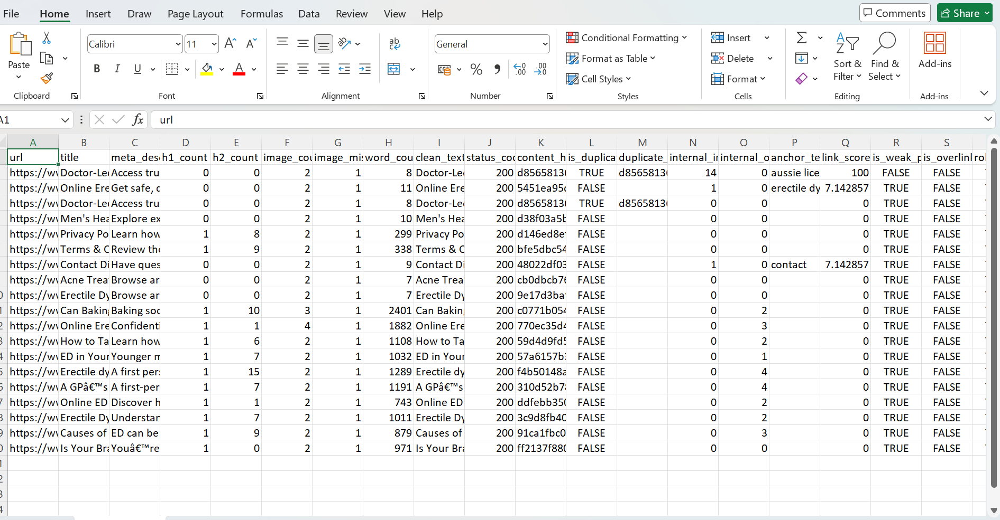

# AI SEO Audit & Automation Agent

AI-powered SEO automation system designed to reduce manual audit effort and scale SEO analysis workflows.

---

## 🚀 Overview

This project automates the complete SEO audit pipeline — from crawling websites to generating structured insights and recommendations.

The system is built as a modular pipeline that processes websites at scale with minimal manual intervention.

---

## 🎯 Problem Solved

Manual SEO audits are:

* Time-consuming
* Inconsistent
* Difficult to scale

This system automates:

* Website crawling
* SEO data extraction
* Technical analysis
* Internal linking analysis
* Duplicate content detection
* SEO scoring
* AI-based recommendations

👉 Result: Significant reduction in manual SEO effort and faster decision-making

---

## ⚙️ System Architecture

Sitemap → Crawl → Parse → Enrich → Analyze → Score → Output

Each stage is modular and can be independently extended or integrated into automation workflows.

---

## 🔧 Key Capabilities

### 1. Automated Crawling

* Extracts URLs from sitemap
* Tracks status codes and response time

### 2. SEO Data Extraction

* Title, meta description, headings
* Word count and content signals
* Image SEO (missing alt tags)

### 3. Technical SEO Automation

* Canonical validation
* Indexability checks
* Redirect chain detection

### 4. Internal Linking Automation

* Builds internal link graph
* Detects orphan pages
* Calculates link importance score

### 5. Duplicate Content Detection

* Hash-based content comparison
* Identifies duplicate pages at scale

### 6. AI-Powered Analysis

* Identifies SEO issues
* Suggests improvements
* Detects missing topics

### 7. Scoring Engine

* Combines multiple SEO factors into a unified score
* Helps prioritize optimization efforts

---

## 📊 Output

The system generates structured outputs:

* Page-level audit report (CSV)
* SEO scores for prioritization
* Technical and content insights

📁 Sample output available in `/output/` folder.

---

## 📸 Sample Output Preview



---

## 🧠 AI Integration

The system uses AI to convert raw SEO signals into actionable insights:

* Missing topics detection
* Content improvement suggestions
* SEO issue identification

---

## 🔄 Automation Use Case

This system is designed as a foundation for SEO automation workflows:

* Trigger audits automatically for new pages
* Generate structured reports for teams
* Feed insights into content optimization pipelines
* Enable scalable SEO analysis across multiple websites

👉 Designed to reduce repetitive manual SEO work significantly

---

## 🔌 Extensibility

The system can be easily extended into:

* API-based services
* Workflow automation tools (n8n, Zapier)
* CMS integrations (WordPress, Shopify)
* SEO tool integrations (Ahrefs / SEMrush APIs)

---

## ⚡ Automation Impact

* Eliminates repetitive manual SEO checks
* Standardizes audit workflows
* Enables scalable SEO operations
* Reduces manual effort significantly

---

## 🛠 Tech Stack

* Python
* BeautifulSoup
* Pandas
* OpenAI API

---

## ▶️ How to Run

```bash
python main.py
```

---

## 🎯 Why This Project

Built to simulate real-world SEO automation systems used in scaling organic growth.

Focus:

* Automation
* Scalability
* AI-driven insights
